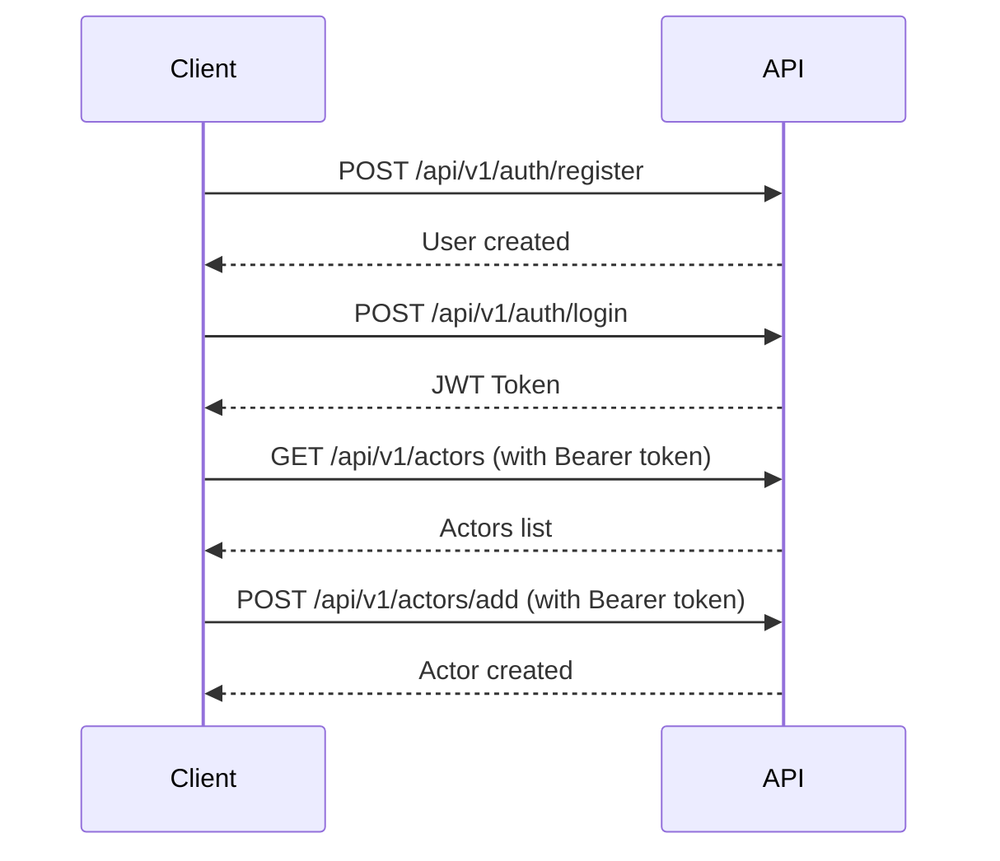

# SimpleMDB API - Complete Implementation Guide

## 🎉 What's New

SimpleMDB now includes **24 RESTful JSON API endpoints** for building client-side rendered applications!

All existing HTML-based functionality remains intact while providing a modern API layer for:
- React, Vue, Angular, or any JavaScript framework
- Mobile applications (iOS, Android, React Native, Flutter)
- Third-party integrations
- API-first development

## 📋 Quick Overview

| Feature | Count | Status |
|---------|-------|--------|
| **Total API Endpoints** | 24 | ✅ Complete |
| Authentication | 3 | ✅ Register, Login, Logout |
| Users (Admin) | 5 | ✅ Full CRUD |
| Actors | 5 | ✅ Full CRUD |
| Movies | 5 | ✅ Full CRUD |
| Actor-Movie Links | 6 | ✅ Full relationship management |

## 🚀 Getting Started

Choose your path:

### For the Impatient (5 minutes)
👉 Start here: **[QUICK_START.md](QUICK_START.md)**
- Get the server running
- Test public endpoints
- Register, login, create data
- See immediate results

### For the Thorough (15 minutes)
👉 Read this: **[HOW_TO_USE_API.md](HOW_TO_USE_API.md)**
- Complete usage guide
- Common workflows
- Best practices
- Troubleshooting

### For the API Reference
👉 Check out: **[API_ENDPOINTS.md](API_ENDPOINTS.md)**
- All 24 endpoints documented
- Request/response examples
- Authentication requirements
- Error handling

### For Command-Line Lovers
👉 Use this: **[CURL_EXAMPLES.md](CURL_EXAMPLES.md)**
- Ready-to-use curl commands
- One command per endpoint
- Copy, paste, execute

### For Developers
👉 Read this: **[IMPLEMENTATION_SUMMARY.md](IMPLEMENTATION_SUMMARY.md)**
- Technical architecture
- Code organization
- Design decisions
- Extension points

## 🔧 Installation & Setup

### 1. Build the Project
```bash
cd /home/runner/work/SimpleMDB/SimpleMDB
dotnet build
```

### 2. Start the Server
```bash
dotnet run
```

Server starts on: `http://127.0.0.1:8080/`

### 3. Test the API
```bash
# Option A: Quick manual test
curl http://127.0.0.1:8080/api/v1/actors

# Option B: Run comprehensive tests
./test_api.sh
```

## 📚 Documentation Index

| Document | Purpose | Audience |
|----------|---------|----------|
| **[QUICK_START.md](QUICK_START.md)** | Get running in 5 minutes | Everyone |
| **[HOW_TO_USE_API.md](HOW_TO_USE_API.md)** | Comprehensive usage guide | API users |
| **[API_ENDPOINTS.md](API_ENDPOINTS.md)** | Complete API reference | Developers |
| **[CURL_EXAMPLES.md](CURL_EXAMPLES.md)** | Ready-to-use commands | CLI users |
| **[IMPLEMENTATION_SUMMARY.md](IMPLEMENTATION_SUMMARY.md)** | Technical details | Contributors |
| **test_api.sh** | Automated test suite | QA/Testing |

## 🎯 Use Cases

### 1. Build a React Frontend
```javascript
// Example: Fetch actors
fetch('http://127.0.0.1:8080/api/v1/actors?page=1&size=10')
  .then(res => res.json())
  .then(data => console.log(data.actors));

// Example: Create actor (with auth)
fetch('http://127.0.0.1:8080/api/v1/actors/add', {
  method: 'POST',
  headers: {
    'Authorization': `Bearer ${token}`,
    'Content-Type': 'application/json'
  },
  body: JSON.stringify({
    firstName: 'Tom',
    lastName: 'Cruise',
    bio: 'American actor',
    rating: 8.5
  })
}).then(res => res.json());
```

### 2. Build a Mobile App
```swift
// iOS Example with URLSession
let url = URL(string: "http://127.0.0.1:8080/api/v1/movies")!
URLSession.shared.dataTask(with: url) { data, response, error in
    guard let data = data else { return }
    let movies = try? JSONDecoder().decode(MoviesResponse.self, from: data)
    // Use movies data
}.resume()
```

### 3. Command-Line Integration
```bash
# Shell script to backup all actors
curl -H "Authorization: Bearer $TOKEN" \
  "http://127.0.0.1:8080/api/v1/actors?page=1&size=1000" \
  | jq '.actors' > actors_backup.json
```

## 🔐 Authentication Flow



## 📊 API Endpoint Categories

### Public Endpoints (No Auth)
- `GET /api/v1/actors` - Browse actors
- `GET /api/v1/movies` - Browse movies
- `POST /api/v1/auth/register` - Create account
- `POST /api/v1/auth/login` - Get token

### Authenticated Endpoints
- All POST operations (add/edit/remove)
- All relationship operations
- All view operations for actors/movies

### Admin-Only Endpoints
- All user management operations (`/api/v1/users/*`)

## 🧪 Testing

### Manual Testing
```bash
# Start server
dotnet run

# In another terminal
curl http://127.0.0.1:8080/api/v1/actors
```

### Automated Testing
```bash
# Run all tests
./test_api.sh

# Expected output:
# ✓ PASS: Register new user
# ✓ PASS: Login with valid credentials
# ✓ PASS: Get all actors without authentication
# ... (24 tests total)
```

### Integration with Testing Tools
- **Postman**: Import as collection
- **Insomnia**: Import as workspace
- **Newman**: Run automated Postman tests
- **JMeter**: Performance testing

## 📁 Project Structure

```
SimpleMDB/
├── src/
│   ├── auth/
│   │   ├── AuthController.cs          (HTML)
│   │   └── AuthApiController.cs       (JSON API) ⭐ NEW
│   ├── users/
│   │   ├── UserController.cs          (HTML)
│   │   └── UsersApiController.cs      (JSON API) ⭐ NEW
│   ├── actors/
│   │   ├── ActorController.cs         (HTML)
│   │   └── ActorsApiController.cs     (JSON API) ⭐ NEW
│   ├── Movies/
│   │   ├── MovieController.cs         (HTML)
│   │   └── MoviesApiController.cs     (JSON API) ⭐ NEW
│   ├── actorsmovie/
│   │   ├── ActorMovieController.cs    (HTML)
│   │   └── ActorMovieApiController.cs (JSON API) ⭐ NEW
│   └── Shared/
│       └── HttpUtils.cs               (Enhanced) ⭐ UPDATED
├── App.cs                             (Routes registered) ⭐ UPDATED
├── API_ENDPOINTS.md                   ⭐ NEW
├── CURL_EXAMPLES.md                   ⭐ NEW
├── HOW_TO_USE_API.md                  ⭐ NEW
├── IMPLEMENTATION_SUMMARY.md          ⭐ NEW
├── QUICK_START.md                     ⭐ NEW
├── test_api.sh                        ⭐ NEW
└── README_API.md (this file)          ⭐ NEW
```

## 🔄 API Design Principles

### 1. Consistency
- All endpoints follow the same patterns
- Consistent error responses
- Predictable status codes

### 2. Separation of Concerns
- API controllers handle HTTP/JSON
- Service layer contains business logic
- Repository layer handles data access

### 3. Backward Compatibility
- All existing HTML routes still work
- No breaking changes to existing functionality
- Can use both APIs simultaneously

### 4. Security First
- Bearer token authentication
- Role-based authorization
- Input validation

## 🎓 Learning Resources

### For Beginners
1. Start with [QUICK_START.md](QUICK_START.md)
2. Try the examples in [CURL_EXAMPLES.md](CURL_EXAMPLES.md)
3. Read [HOW_TO_USE_API.md](HOW_TO_USE_API.md)

### For Developers
1. Read [IMPLEMENTATION_SUMMARY.md](IMPLEMENTATION_SUMMARY.md)
2. Explore the API controller source code
3. Study [API_ENDPOINTS.md](API_ENDPOINTS.md) for details

### For Integration
1. Use [API_ENDPOINTS.md](API_ENDPOINTS.md) as reference
2. Run `test_api.sh` to see all operations
3. Build your client using the patterns shown

## 🐛 Troubleshooting

### Common Issues

**Problem**: "Connection refused"
```bash
# Solution: Make sure server is running
dotnet run
```

**Problem**: "Unauthorized" error
```bash
# Solution: Include the Bearer token
curl -H "Authorization: Bearer YOUR_TOKEN" ...
```

**Problem**: "Invalid JSON data"
```bash
# Solution: Add Content-Type header
curl -H "Content-Type: application/json" ...
```

**Problem**: "Forbidden" error
```bash
# Solution: Endpoint requires admin role
# Login as admin or use non-admin endpoints
```

See [HOW_TO_USE_API.md](HOW_TO_USE_API.md#troubleshooting) for more solutions.

## 🚀 Next Steps

### Immediate (Now)
- [x] Review this README
- [ ] Run `./test_api.sh`
- [ ] Try examples from [QUICK_START.md](QUICK_START.md)

### Short Term (This Week)
- [ ] Build a simple frontend with React/Vue
- [ ] Create a mobile app proof-of-concept
- [ ] Test all endpoints with Postman

### Long Term (This Month)
- [ ] Deploy to production
- [ ] Add API versioning (v2)
- [ ] Implement rate limiting
- [ ] Add API documentation UI (Swagger/OpenAPI)

## 💡 Pro Tips

1. **Save Your Token**: Store it in an environment variable
   ```bash
   export SIMPLEMDB_TOKEN="your_token_here"
   curl -H "Authorization: Bearer $SIMPLEMDB_TOKEN" ...
   ```

2. **Use jq for Pretty JSON**: 
   ```bash
   curl ... | jq
   ```

3. **Test Before Building**: Use the API directly before building your frontend

4. **Check Status Codes**: Use `-i` flag to see response headers
   ```bash
   curl -i http://127.0.0.1:8080/api/v1/actors
   ```

## 📞 Support & Contributing

- **Issues**: Report bugs or request features on GitHub
- **Documentation**: Help improve these docs
- **Code**: Submit pull requests for enhancements

## 📄 License

Same as SimpleMDB project.

---

## Summary

✅ **24 API endpoints** covering all CRUD operations  
✅ **Complete documentation** with examples  
✅ **Automated testing** included  
✅ **Ready for production** use  
✅ **Zero breaking changes** to existing code  

**Start building your client-side application today!** 🎉

Begin with: **[QUICK_START.md](QUICK_START.md)**
